# Documentación de la interfaz — Menudo armario
App android de tienda de ropa y calzado infantil (0 a 14 años) **Menudo armario**. Diseño basado en Material Design 3 y pensado para comprar rápido, con una mano y sin miedo a equivocarse de talla.

## 1. Justificación del diseño

### 1.1 Importancia del diseño centrado en el usuario

Quien compra ropa infantil casi nunca es quien la va a llevar. Compra una madre con el bebé en brazos, un padre en la cola del médico o un abuelo que no sabe qué talla usa su nieta. Si diseñamos pensando en el catálogo y no en estas personas, la app acaba siendo una web de tienda metida en un móvil: menús profundos, tallas confusas y formularios largos.

Por eso el proyecto sigue un proceso de diseño centrado en el usuario (ISO 9241-210): primero entender quién compra y en qué contexto, después decidir la estructura, prototipar y, por último, comprobar con personas reales si funciona. Cada decisión de la interfaz de este documento se apoya en un insight de la sección 2.4 o en un resultado de las pruebas de la sección 4.

### 1.2 Objetivos y metas del proyecto

| # | Objetivo | Cómo se mide | Meta |
| O1 | Comprar rápido | Tiempo desde Inicio hasta Confirmación en la tarea de compra | Menos de 2 minutos y al menos el 80 % de participantes lo consigue sin ayuda |
| O2 | Acertar con la talla | Participantes que eligen la talla correcta en la tarea de regalo usando la guía de tallas | 100 % de aciertos y menos de 30 s en la guía |
| O3 | Usable con una mano y accesible | Revisión de las 7 pantallas: áreas táctiles, posición de las acciones principales y contraste | 100 % de áreas táctiles ≥ 48 × 48 dp, acción principal siempre en la mitad inferior y todas las parejas de color ≥ 4,5:1 |

### 1.3 Beneficios esperados

Para quien compra
- Encuentra lo que busca en menos pasos gracias a la entrada por edad (Bebé, Niña, Niño).
- Menos dudas con las tallas: la guía está en el propio producto y traduce la talla a edad y altura.
- Puede deshacer errores (eliminar del carrito, datos mal escritos) sin empezar de nuevo.
- Puede comprar un regalo sin saber la talla exacta y cambiarlo en cualquier tienda física.

Para el negocio
- Menos devoluciones por talla equivocada, uno de los motivos de cambio más frecuentes en ropa infantil.
- Más pedidos terminados al reducir el checkout a una sola pantalla y permitir comprar como invitado.
- Más visitas a tienda física con la opción de recogida y cambio en tienda.
- Una base de diseño (tokens y componentes M3) reutilizable para futuras funciones y para una versión web

## 2. Investigación y análisis de usuarios

### 2.1 Datos demográficos y segmentación

La investigación es básica y parte del briefing de la cadena, de la observación de apps de la competencia y de conversaciones informales con familiares y compañeros. No son datos estadísticos, sino hipótesis de trabajo que se contrastan en las pruebas de la sección 4.

| Segmento | Perfil | Qué compra | Cómo usa el móvil |
|----------|--------|------------|-------------------|
| Madres y padres | 28-45 años, trabajan, hijos de 0 a 14 años | Compra recurrente: básicos, cambios de talla, vuelta al cole | Con soltura, con prisas y a menudo con una sola mano libre |
| Abuelas y abuelos | 60-75 años | Regalos puntuales (cumpleaños, Navidad) | Uso básico; les cuesta la letra pequeña y los iconos sin texto |
| Otras personas que regalan | Tíos, amistades, 20-50 años | Regalo para un bebé o un niño que no ven a diario | Con soltura, pero no conocen la talla del niño |

Rasgos comunes: poco tiempo, compra desde el móvil en momentos sueltos del día y una duda constante con las tallas, porque los niños crecen rápido y cada marca talla distinto.

### 2.2 Personas

#### Persona 1: Laura Gómez, la madre que compra en ratos muertos

- **Edad:** 34 años.
- **Contexto:** enfermera a turnos en Sevilla. Tiene a Julio (6 años) y a Sergio (18 meses). Compra desde el móvil en el autobús o mientras duerme a la pequeña, casi siempre con una mano.
- **Objetivos:** reponer rápido lo que se les queda pequeño, acertar con la talla a la primera y recoger en la tienda que tiene al lado de casa.
- **Frustraciones:** apps que obligan a registrarse antes de pagar, filtros escondidos en menús, y que la talla «2 años» de una marca le quede grande y la de otra, pequeña.
- **Frase:** «Si en tres toques no he encontrado un pijama, cierro la app».

#### Persona 2: Antonio Ruiz, el abuelo que busca un regalo

- **Edad:** 68 años.
- **Contexto:** jubilado en Sevilla. Su nieta Lucía cumple 4 años y vive en otra ciudad. Usa WhatsApp y poco más; compra por internet de vez en cuando porque se lo han enseñado sus hijos.
- **Objetivos:** encontrar un vestido bonito, saber qué talla pedir sin tener que llamar a su hija y que, si no vale, lo puedan cambiar en una tienda.
- **Frustraciones:** letra pequeña, iconos que no sabe qué significan, formularios que se borran si se equivoca en un campo y el miedo a pagar algo que no quería.
- **Frase:** «No sé si a los 4 años se pide la talla 4 o la 5».

### 2.3 Análisis de la competencia

Revisión de las apps Android de cuatro marcas que venden moda infantil en España, centrada en el recorrido de compra de ropa de niño.

| App | Qué hace bien | Qué hace mal | Qué me llevo |
|-----|---------------|--------------|--------------|
| **Zara** (sección Niños) | Fotos grandes y cuidadas; separa bebé, niña y niño desde el principio; indica la talla con edad y centímetros | Estética tan minimalista que algunos iconos y textos son muy pequeños; los filtros no están a la vista | Entrada por edad en Inicio y talla expresada en edad + altura |
| **H&M** | Filtros claros por talla, color y precio; carrito accesible desde cualquier pantalla | Muchos avisos y banners promocionales que tapan el contenido; el registro se ofrece con insistencia | Filtros como chips visibles encima del catálogo; comprar como invitado sin interrupciones |
| **Kiabi** | Precios visibles y promociones claras; opción de recoger en tienda | Pantallas cargadas de promociones que compiten con el producto; jerarquía visual poco clara | Recogida en tienda en el checkout, pero con una jerarquía limpia |
| **Vertbaudet** | Especializada en infantil: tallas por edad y guía de tallas detallada | La guía de tallas abre una página aparte y hace perder el producto; catálogo muy denso | Guía de tallas dentro del producto como bottom sheet, sin salir de la pantalla |

### 2.4 Insights y hallazgos clave

| # | Insight | Decisión de diseño |
|---|---------|--------------------|
| I1 | Dudan mucho con las tallas y cada marca talla distinto | Botón «Guía de tallas» en el detalle que abre un **bottom sheet** con la equivalencia talla → edad → altura. El **SelectorTalla** muestra la edad bajo cada talla y marca las que no tienen stock |
| I2 | Compran con una mano y con prisas | **Navigation bar** inferior con 3 destinos, botón principal fijo en la parte baja de Detalle, Carrito y Checkout, y todas las áreas táctiles de al menos 48 × 48 dp |
| I3 | Buscan por edad, no por tipo de prenda | Inicio empieza por las tres categorías de edad (Bebé 0-24 m, Niña, Niño) y el catálogo filtra por edad/talla con **filter chips** siempre visibles |
| I4 | Muchos compran regalos sin conocer la talla | Casilla «Es un regalo» en el checkout (ticket regalo sin precio) y aviso de cambio gratis en cualquier tienda física |
| I5 | Tienen miedo a equivocarse y perder lo hecho | **Snackbar «Deshacer»** al eliminar del carrito y errores del formulario con mensaje de ayuda que dice cómo corregirlo, sin borrar lo escrito |
| I6 | Deciden en varios ratos, no de una vez | **Favoritos** como destino de la navigation bar para guardar prendas y volver después |

## 3. Diseño de la interfaz

### 3.1 Mapa de navegación

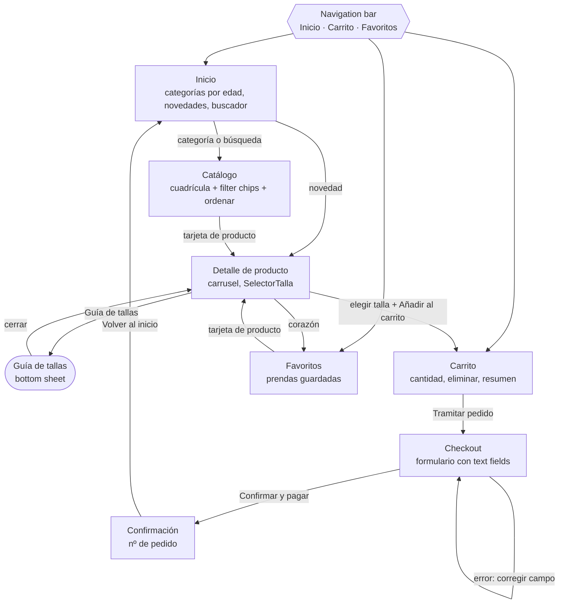

La app tiene dos niveles: los tres destinos principales de la navigation bar y las pantallas de detalle del flujo de compra. Catálogo no está en la navigation bar porque se llega siempre desde una categoría o una búsqueda de Inicio, que es como compran nuestras personas (I3).

### 3.2 Wireframes

Siete wireframes de baja fidelidad en escala de grises, frame Android Compact de 360 × 800, en la página «Wireframes» de Figma (versión «Reto 2 – wireframes»).

| Pantalla | Wireframe | Qué resuelve |
|----------|-----------|--------------|
| 1. Inicio | 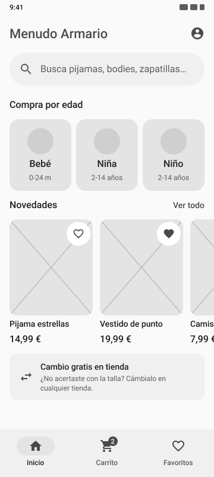 | Buscador arriba, tres categorías por edad como primer bloque y novedades en carrusel horizontal |
| 2. Catálogo | 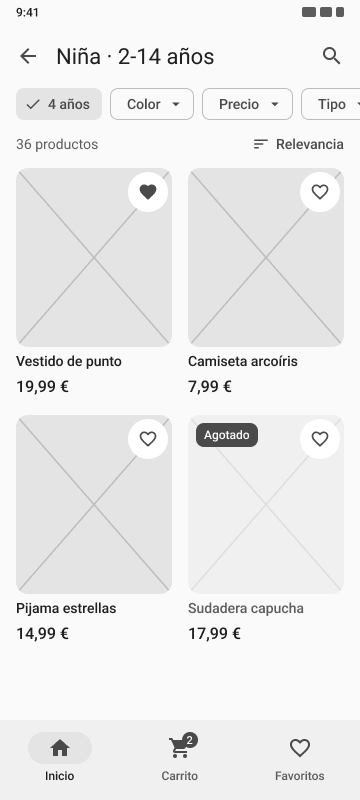 | Chips de edad/talla, color y precio fijos bajo la top app bar; cuadrícula de 2 columnas y botón de ordenar |
| 3. Detalle | 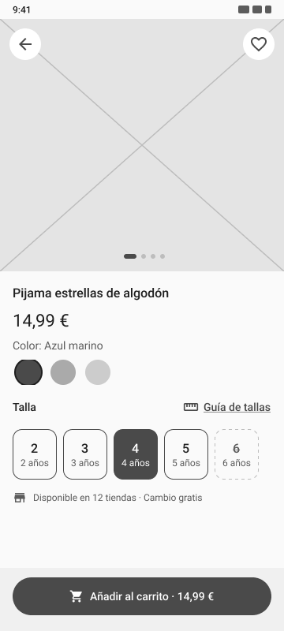 | Carrusel de fotos, precio, selector de talla con enlace a la guía y botón «Añadir al carrito» fijo abajo |
| 4. Carrito | 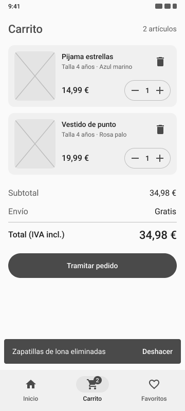 | Líneas con cantidad (− / +) y papelera, resumen del importe y botón «Tramitar pedido» abajo |
| 5. Checkout | 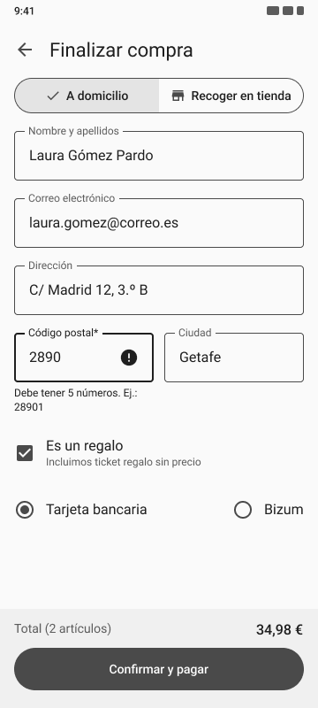 | Una sola pantalla: entrega (domicilio o tienda), datos, casilla de regalo y pago |
| 6. Confirmación | 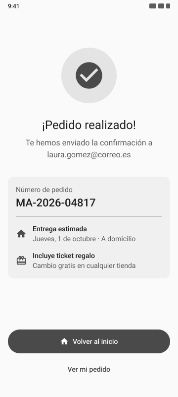 | Mensaje claro, número de pedido y botón para volver al inicio |
| 7. Favoritos | 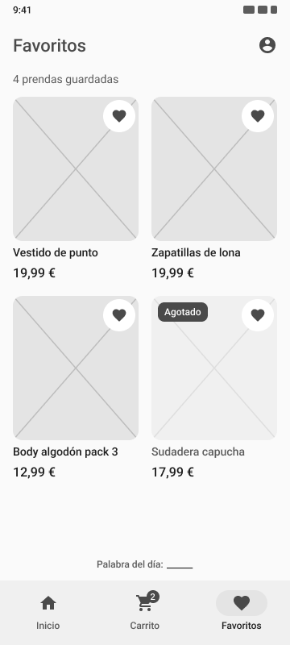 | Cuadrícula de prendas guardadas y pie con la palabra del día |

### 3.3 Guía de estilo Material Design 3

Los tokens completos están en [`diseno/estilos.json`](diseno/estilos.json).

#### Color

- **Color semilla:** `#E0694E`, un coral cálido. Transmite cercanía y alegría sin caer en los tópicos rosa/azul, y funciona igual para niña y niño.
- Esquema generado con **Material Theme Builder** (variante *Tonal spot*) en claro y oscuro, aplicado en Figma como estilos de color con los nombres de rol M3 (`primary`, `on-primary`, etc.).

| Rol | Claro | Oscuro |
|-----|-------|--------|
| primary / onPrimary | `#904B3B` / `#FFFFFF` | `#FFB4A3` / `#561F12` |
| primaryContainer / onPrimaryContainer | `#FFDAD2` / `#733426` | `#733426` / `#FFDAD2` |
| secondary / onSecondary | `#77574F` / `#FFFFFF` | `#E7BDB4` / `#442A24` |
| tertiary / onTertiary | `#6D5D2E` / `#FFFFFF` | `#DBC58C` / `#3C2F04` |
| surface / onSurface | `#FFF8F6` / `#231917` | `#1A110F` / `#F1DFDB` |
| error / onError | `#BA1A1A` / `#FFFFFF` | `#FFB4AB` / `#690005` |

#### Contraste (WCAG 2.2, nivel AA: mínimo 4,5:1 para texto normal)

| Pareja color / on-color | Ratio claro | Ratio oscuro | ¿Cumple AA? |
|-------------------------|-------------|--------------|-------------|
| primary / onPrimary | 6,45:1 | 7,69:1 | Sí |
| primaryContainer / onPrimaryContainer | 7,21:1 | 7,21:1 | Sí |
| secondary / onSecondary | 6,44:1 | 7,70:1 | Sí |
| tertiary / onTertiary | 6,45:1 | 7,73:1 | Sí |
| surface / onSurface | 16,36:1 | 14,43:1 | Sí (también AAA) |
| error / onError | 6,46:1 | 7,72:1 | Sí |

Comprobación adicional: el texto secundario (`onSurfaceVariant` `#534340` sobre `surface`) da 8,91:1 en claro y 10,94:1 en oscuro, y el enlace «Guía de tallas» en `primary` sobre `surface` da 6,15:1. Los ratios se han calculado con la fórmula de luminancia relativa de WCAG y se pueden comprobar con cualquier verificador de contraste.

#### Tipografía

Familia **Roboto**, escala tipográfica de M3:

| Rol | Tamaño / interlineado | Peso | Uso en la app |
|-----|----------------------|------|---------------|
| headlineSmall | 24 / 32 | 400 | Títulos de pantalla grandes (Confirmación) |
| titleLarge | 22 / 28 | 400 | Título de la top app bar, precio en Detalle |
| titleMedium | 16 / 24 | 500 | Nombre del producto, títulos de sección |
| bodyLarge | 16 / 24 | 400 | Textos de lectura, campos del formulario |
| labelLarge | 14 / 20 | 500 | Botones, chips, enlaces («Guía de tallas», «Ver todo») |

Las etiquetas de la navigation bar usan labelMedium (12 / 16, peso 500), como indica M3 para ese componente. No se usa ningún texto por debajo de 12 sp, pensando en personas como Antonio.

#### Rejilla y espaciado

- **4 columnas** en el frame de 360 dp, con **márgenes de 16 dp** y medianiles de 8 dp.
- Todas las distancias son **múltiplos de 8 dp** (8, 16, 24, 32…); 4 dp solo para ajustes finos dentro de un componente.
- **Áreas táctiles de al menos 48 × 48 dp** en botones, chips, iconos y tallas.
- Acciones principales en la mitad inferior de la pantalla, al alcance del pulgar.

#### Componentes

- **Del kit M3:** top app bar, navigation bar, card, filter chip, button (filled, outlined y text), text field (outlined), snackbar y bottom sheet.
- **Propios, con variantes y auto layout:**
  - `TarjetaProducto` → `normal`, `favorito`, `agotado`. Foto, nombre, precio y botón de favorito; la variante agotado baja la opacidad de la foto y muestra la etiqueta «Agotado».
  - `SelectorTalla` → `disponible`, `seleccionada`, `sin stock`. Botón de 56 × 56 dp con la talla y la edad debajo; la variante sin stock va tachada y no es pulsable.

#### Accesibilidad

- Nunca se transmite información solo con color: las tallas sin stock van tachadas y los errores llevan icono y texto.
- Iconos de la navigation bar siempre con etiqueta de texto.
- Los errores del formulario explican cómo corregirlos (p. ej., «El código postal tiene 5 números»).

### 3.4 Prototipo de alta fidelidad

- **Archivo de Figma:** [T1 Menudo armario javier saravia](https://www.figma.com/design/Nrh4iQ6bEis6kerCMDAQs0/T1-Menudo-armario-javier-saravia)
- **Versión con nombre:** «Reto 4 – alta fidelidad».

#### Flujo conectado

Inicio → Catálogo → Detalle → Carrito → Checkout → Confirmación → Inicio. Desde el Detalle se abre la guía de tallas como superposición sin salir de la pantalla. La navigation bar navega entre Inicio, Carrito y Favoritos desde las pantallas principales. El flujo arranca en Inicio.

#### Interacciones

| Disparador | Acción | Animación |
|------------|--------|-----------|
| Tocar una categoría en Inicio | Navegar a Catálogo | Smart Animate |
| Tocar una tarjeta de producto | Navegar a Detalle | Smart Animate |
| Tocar «Guía de tallas» | Abrir superposición (bottom sheet con fondo oscurecido) | Desde abajo |
| Tocar fuera del bottom sheet | Cerrar superposición | Smart Animate |
| Tocar «Añadir al carrito» | Navegar a Carrito | Smart Animate |
| Tocar «Confirmar y pagar» | Navegar a Confirmación | Smart Animate |
| Tocar la flecha de volver | Volver a la pantalla anterior | Smart Animate |
| Tocar un destino de la navigation bar | Navegar a Inicio, Carrito o Favoritos | Smart Animate |

El Carrito incluye la snackbar «Deshacer» para recuperar un producto eliminado, y el Checkout muestra un campo en estado de error con icono y texto que explica cómo corregirlo.

#### Pantallas

| | | |
|---|---|---|
| 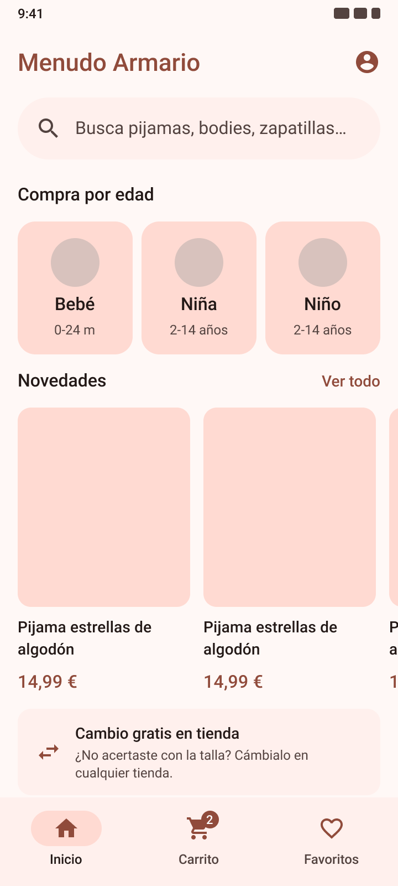 | 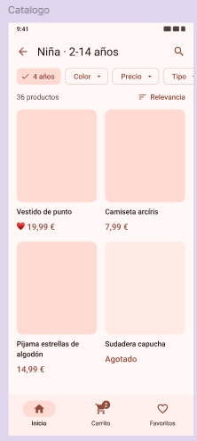 | 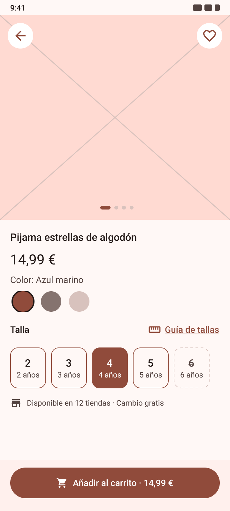 |
| 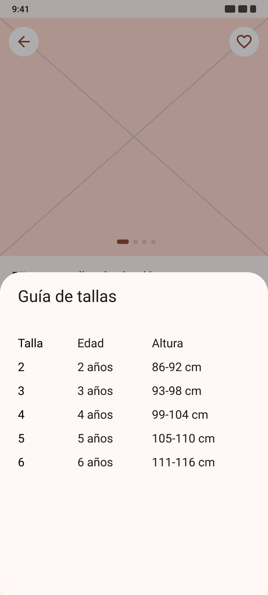 | 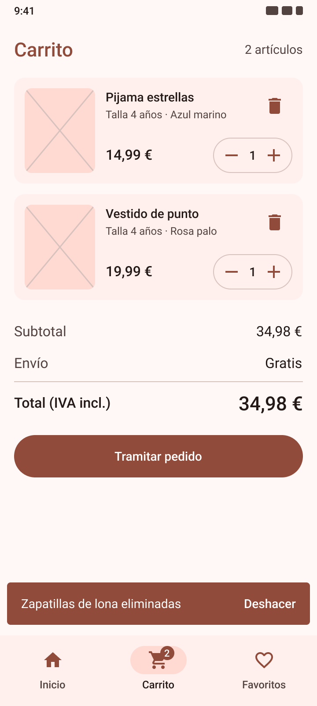 | 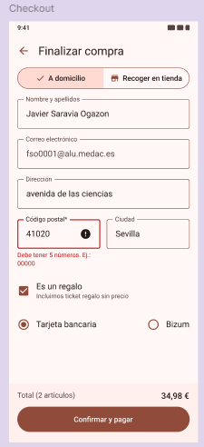 |
| 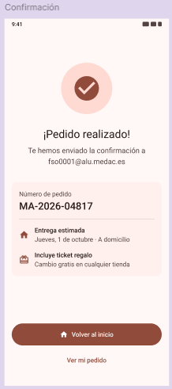 | 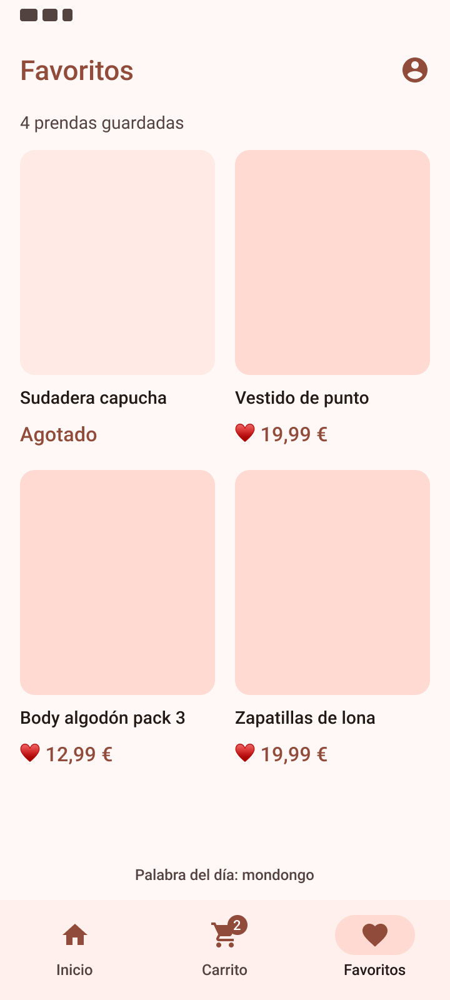 | |

**Modo oscuro** (esquema oscuro de Material Theme Builder, aplicado con el modo Dark de la colección de variables «M3»):

| | |
|---|---|
| 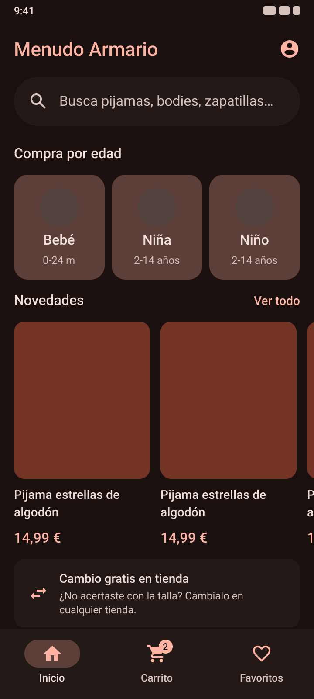 | 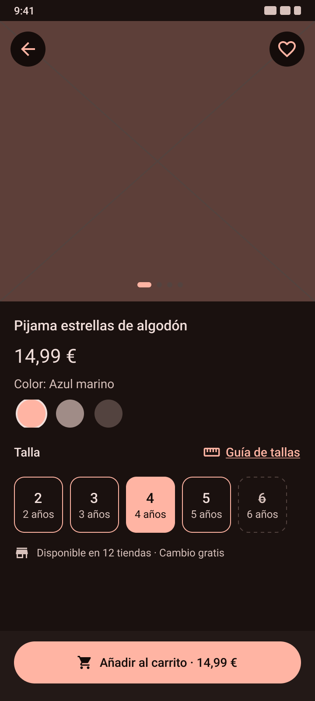 |

---

Palabra del día: mondongo
